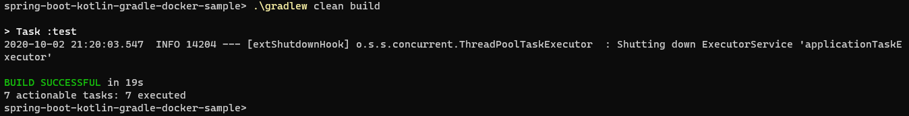
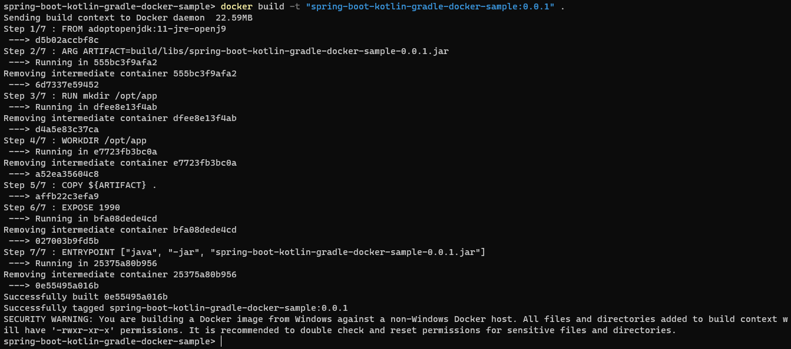
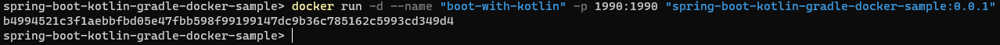
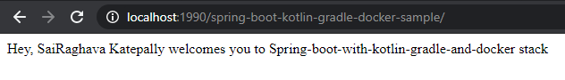
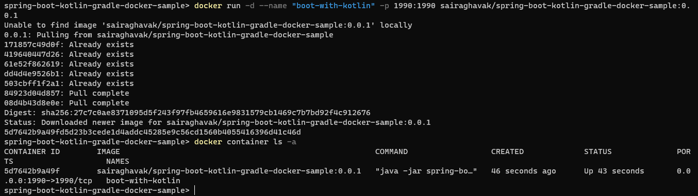

# spring-boot-kotlin-gradle-docker-sample
Title of the repo is self-explanatory and it lives up to it

# How to run this locally

1. `.gradlew clean build`
    - 
2. `docker build -t "kotlin_gradle_spring_boot_docker_hello_world:0.0.1" .`
    - 
3. `docker run -d -p 1990:1990 kotlin_gradle_spring_boot_docker_hello_world:0.0.1`
    - 
4. Launch the url at `http://localhost:1990/sairaghavak`
    - 

# Quick launch of artifact for the impatient through docker

- For impatient, here is the direct command to spin the container
`docker run -d --name "boot-with-kotlin" -p 1990:1990 sairaghavak/spring-boot-kotlin-gradle-docker-sample:0.0.1`
    = 
    